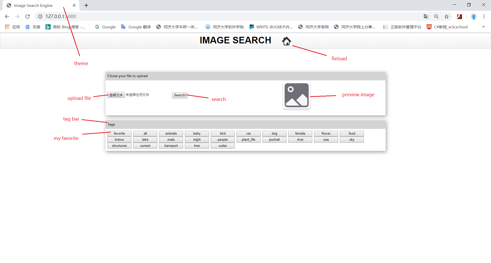
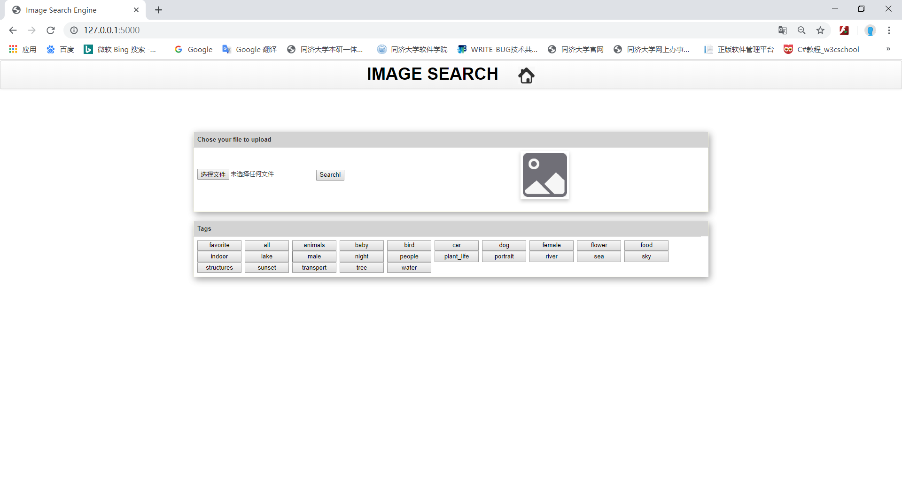
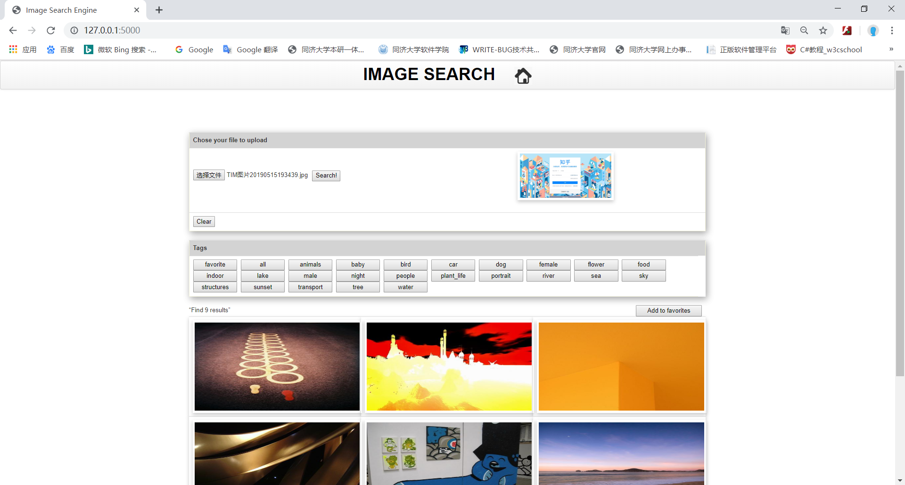
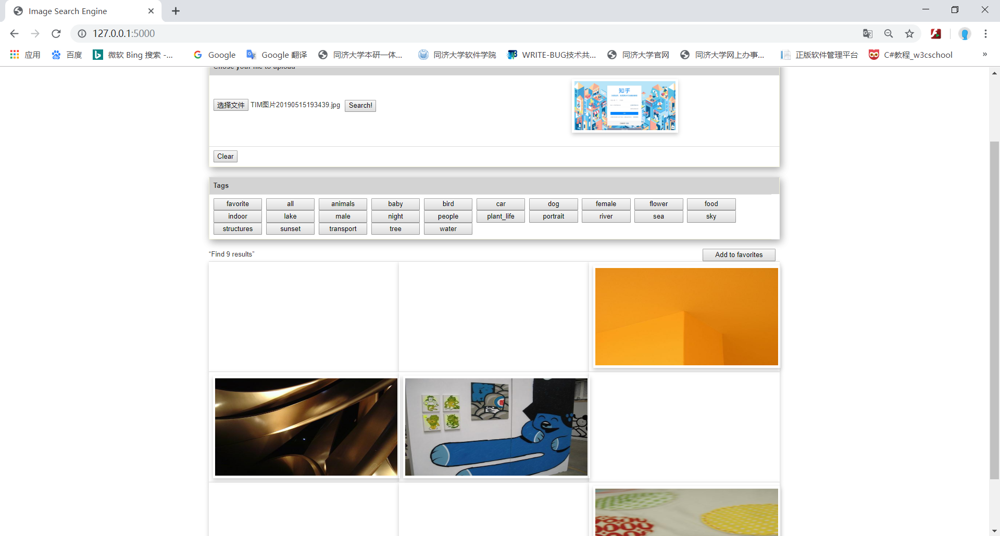
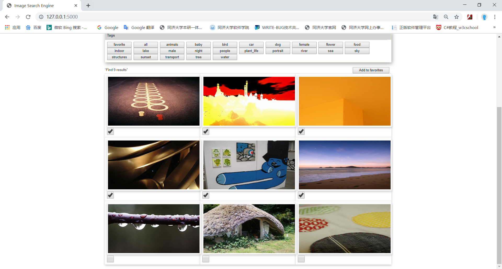
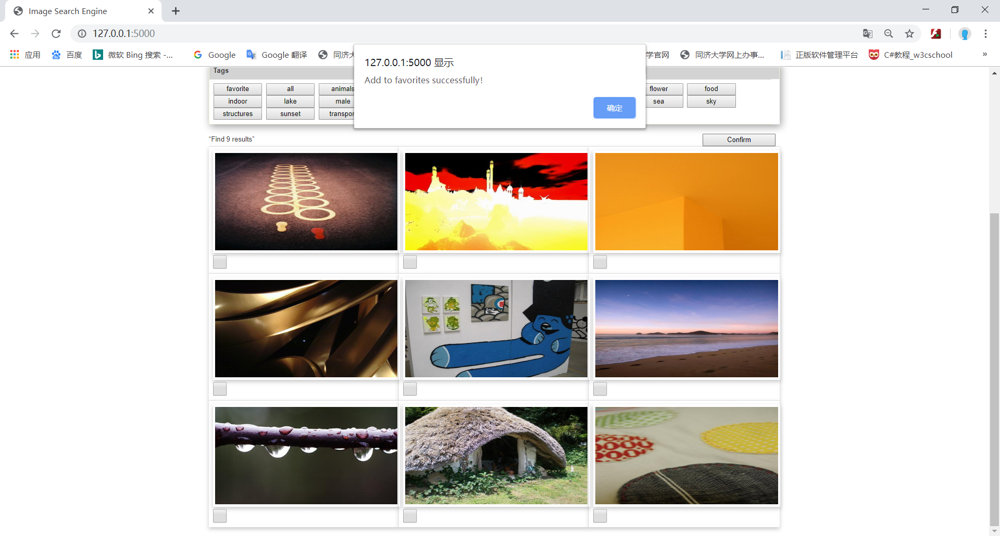
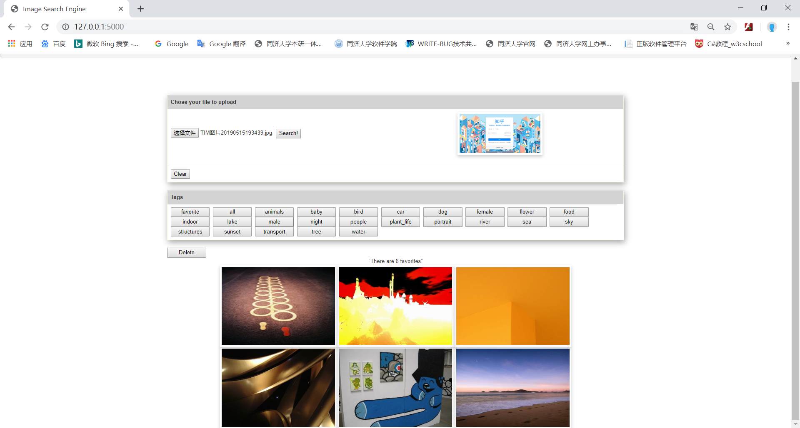
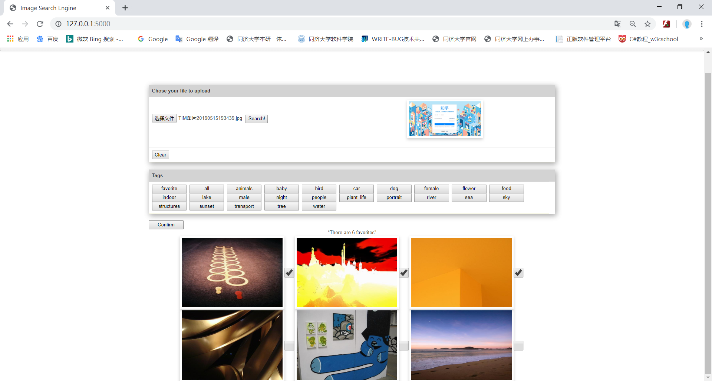
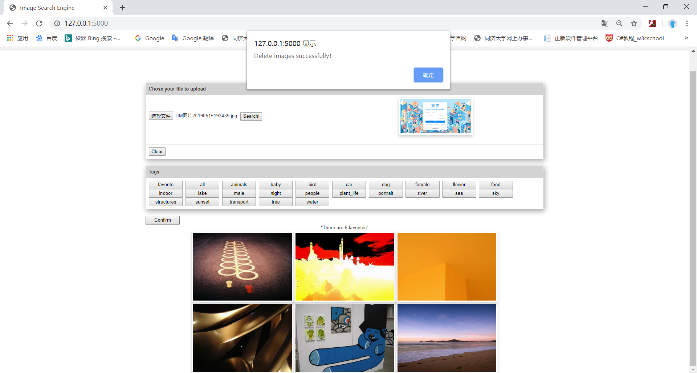
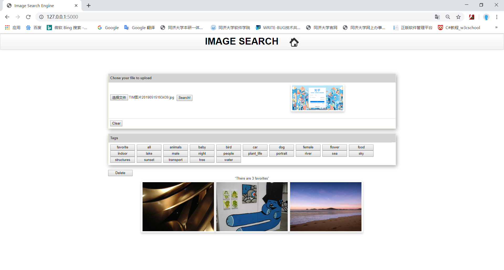

# 1 Project Overview

## 1.1 Project Description

Based on tensorflow and Flask, a web-based image search engine is realized, which can realize simple image search function based on server images database.

## 1.2 Project function requirements

●It contains an input box to upload an image (Formulation);

●Users can preview the query image in the searching window (Formulation);

●It has a search button (Initiation);

●Provide an overview of the results (e.g. the total number of results) (Review);

●Allow changing search parameters (e.g. select certain category/tag) when reviewing results (Refinement);

●Users can take some actions, e.g. add selected images to a favorite list (Use);

# 2 Design and implementation

## 2.1 Design

### 2.1.1 Code design

The program code is divided into two parts: front end and back end. The front and back end realize data transmission through Flask. The back end is python program, and the front end is web application.

The file directory structure is as follows:

├── database
│       ├── dataset
│       └── tags
├── imagenet
├── static
│       ├── favorite
│       ├── images
│       └── result
├── uploads
├── templates
│       └── HTML
└── .py

#### Main function design:

front end:

```javascript
//Show favorite function, bind with favorite button
    function favorite_fun()

//Add a favorite function, bound to the Add to favorites button
    function addFavorite_fun()

//Confirm the collection function, bind to the Confirm collection button
    function confirm_fun()

//Delete favorite image function, bind with Delete button
    function delete_fun()

//Confirm delete function, bind with Confirm delete button
    function confirmdelete_fun()

//Tag selection function, binding to each tag button except favorite, passing arguments by str
    function tag_fun(str)

//Search function, bound to the Search button
    function fun()
```

back end:

```python
# This function is used to do the image search/image retrieval
@app.route('/imgUpload', methods=['GET', 'POST'])  # /imgUpload matches the url in ajax
def upload_img():
    
# This function is tag
@app.route('/tag', methods=['GET', 'POST'])
def tag():
    
# This function is addFavorite
@app.route('/addFavorite', methods=['GET', 'POST'])
def addFavorite():
    
# This function is displaying favorites
@app.route('/favorite', methods=['GET', 'POST'])
def favorite():
    
# This function is deleting favorites
@app.route('/deleteFavorite', methods=['GET', 'POST'])
def deleteFavorite():

```

### 2.1.2 interface design

#### Start interface:

Include theme、upload file button、search button、preview image、tag bar and my favorites.



#### Search results interface:

Show search results and description of search results：


#### My favorites interface：

Show a collection of pictures, a description of the number of pictures.


## 2.2 Implementation

### 2.2.1 Main function implementation

#### Show search results

#### front end：

```javascript
 function fun(){
        $('#div2').hide();//Hide favorites content
		$('#load').show();//Display loading animation
        $("#confirm").hide();//Hide Confirm Favorites button
        $("#addFavorite").show();//Show Add to favorites button   

   		$("form").submit(function(evt){	  
            evt.preventDefault();
            var formData = new FormData($(this)[0]);
            $.ajax({
                url: 'imgUpload',
                type: 'POST',
                data: formData,
                //async: false,
                cache: false,
                contentType: false,
                enctype: 'multipart/form-data',
                processData: false,
                
                success: function (response) {//Response returns the searched image path
                    $('#load').hide();//Hidden loading animation
                    $('#clearrow').show();//Show Clear button
                    //Show searched images
                    $("#img0").show();
                    $("#img1").show();
                    $("#img2").show();
                    $("#img3").show();
                    $("#img4").show();
                    $("#img5").show();
                    $("#img6").show();
                    $("#img7").show();
                    $("#img8").show();
                    //Assign values ​​to each image path
                    document.getElementById("img0").src = response.image0;
                    console.log(response.image0);
                    console.log(document.getElementById("img0").src);
                    document.getElementById("img1").src = response.image1;
                    document.getElementById("img2").src = response.image2;
                    document.getElementById("img3").src = response.image3;
                    document.getElementById("img4").src = response.image4;
                    document.getElementById("img5").src = response.image5;
                    document.getElementById("img6").src = response.image6;
                    document.getElementById("img7").src = response.image7;
                    document.getElementById("img8").src = response.image8;
                    $('#table').show();//Display picture table
                    $('#resultStats').show();//Display result statement
                    $('#clear').show();//Show Clear button
                }
            });
        return false;
        })
    }
```

#### back end：

```python
@app.route('/imgUpload', methods=['GET', 'POST'])  # /imgUpload matches the url in ajax
def upload_img():
    print("image upload")
    result = 'static/result'
    if not gfile.Exists(result):  # If there is no result folder, create it
        os.mkdir(result)
    shutil.rmtree(result)  # Empty the result folder

    if request.method == 'POST' or request.method == 'GET':
        print(request.method)
        # check if the post request has the file part
        if 'file' not in request.files:
            print('No file part')
            return redirect(request.url)

        file = request.files['file']
        print(file.filename)
        # if user does not select file, browser also
        # submit a empty part without filename
        if file.filename == '':
            print('No selected file')
            return redirect(request.url)
        if file:  # and allowed_file(file.filename):
            filename = secure_filename(file.filename)
            file.save(os.path.join(app.config['UPLOAD_FOLDER'], filename))
            inputloc = os.path.join(app.config['UPLOAD_FOLDER'], filename)
            recommend(inputloc, extracted_features)
            os.remove(inputloc)
            image_path = "/result"
            image_list = [os.path.join(image_path, file) for file in os.listdir(result)
                          if not file.startswith('.')]
            images = {
                'image0': image_list[0],
                'image1': image_list[1],
                'image2': image_list[2],
                'image3': image_list[3],
                'image4': image_list[4],
                'image5': image_list[5],
                'image6': image_list[6],
                'image7': image_list[7],
                'image8': image_list[8]
            }
            return jsonify(images)
```

#### Show favorites

#### front end：

```javascript
//Show favorite function, bind with favorite button
    function favorite_fun(){
        $.ajax({
      		 url: 'favorite',
       		 type: 'POST',
      		 cache: false,
      		 contentType: false,
      		 enctype: 'multipart/form-data',
      		 processData: false,
      		 success: function (response) {//Get the image file name in the favorites from the response
                $('#div2').show();//Showcase your favorites
                $('#table').hide();//Hide search results
                $('#resultStats').hide();//Hide search results description
                var str = response;
                console.log(str);//Print the image file name in your favorites
                var rows = str.length/3 + 1;
                var cols = 3;
                div1 = document.getElementById('div1');
                //Dynamically add a favorite image table
                var tab='<div id="favoriteStats">“There are '+ str.length +' favorites” </div>';
                tab+='<table id = "favoritetable" class="table" style="background: white; border: 1px ;display:none;" >';
                var number = 0;
                for(var i=0;i<rows;i++){
                    tab+='<tr>';
                    for(var j=0;j<cols;j++){
                        if(number < str.length){
                        tab+='<td style= "box-shadow: 0 4px 8px 0 rgba(0,0,0,0.2); transition: 0.3s;width: 200px;height: 200px;padding-top: 0px;padding-bottom: 0px;padding-right: 0px;padding-left: 0px;border-left-width: 1px;border-bottom-width: 1px;border-right-width: 1px;background: white;">'+(i+j)+'</td>';
                        tab+='</img>';
                        tab+='<input type= checkbox id = checkfavoriteimg'+number+' name="checkimg2" value= favoriteimg'+number+' style= "display:none; width:30px; height:30px;">';
                        }
                        number ++;
                    }
                    tab+='</tr>';
                }    
                tab+='</table>';
                div1.innerHTML=tab;
            }  
   		});
    }
```

#### back end：

```python
@app.route('/favorite', methods=['GET', 'POST'])
def favorite():
    print('favorite')
    image_list = []  # image_list store all image names under the favorite folder
    for filename in os.listdir(r"static/favorite"):  # listdir's parameter is the path of the folder
        image_list.append(filename)
        print(filename)  # The filename is the name of the files in the favorite folder.

    images = {}
    for i in range(0, len(image_list)):
        images['image'+str(i)] = image_list[i]
    return jsonify(image_list)
```

#### Delete favorites

#### front end：

```javascript
//Confirm delete function, bind with Confirm delete button
    function confirmdelete_fun(){        
        var checked = document.getElementsByName("checkimg2");//Read the contents of the picture selection box according to the name
        console.log(checked)//Print the read content
        var checkedData = [];//Store the file name of the selected picture picture
        var j = 0;
        for (var i = 0; i < checked.length; i++) {
            $("#checkfavoriteimg"+i).hide();
            if (checked[i].checked){//When the selection box is selected
                console.log(checked[i].value);//Print the selected image corresponding to the value of the selection box, and print the id of the selected image
                console.log(document.getElementById(checked[i].value).src);//Print the address of the selected image in the format of http://127.0.0.1:5000/result/im1428.jpg
                checkedData.push(document.getElementById(checked[i].value).src);//Get the image address according to the picture id, the address format is http://127.0.0.1:5000/result/im1428.jpg

                if(checkedData[j].indexOf("/")>0)//If the "/" is included, the string is intercepted starting from the last "/" +1
                    {checkedData[j]=checkedData[j].substring(checkedData[j].lastIndexOf("/")+1,checkedData[j].length);}
                else
                    {checkedData[j]=checkedData[j];}
                j++;
                checked[i].checked = false;//The status of the selection box is unchecked, otherwise the status of the selection box will not be refreshed after the final confirmation of the collection
            }
        }
        console.log(checkedData)//Print the file name of the selected picture
        console.log(JSON.stringify({checkedData}))//Print the result of checked data being jsonized         
        $.ajax({
                url: 'deleteFavorite',
                type: 'POST',
                data: JSON.stringify({checkedData}),//Transfer the "checkedData" json
                dataType: 'json',
                contentType: 'application/json; charset=UTF-8',//Transfer data in json format
                success: function () {
                    if(j>0){
                    alert("Delete images successfully！");//Pop up Delete images successfully! Prompt box
                    }
                    $("#delete").show();//Show Delete button
                    $("#confirmdelete").hide();//Hide Confirm Delete button
                    favorite_fun()//Show remaining images in favorites after deletion
                }
            });    
    }                     
```

#### back end：

```python
# This function is deleting favorites
@app.route('/deleteFavorite', methods=['GET', 'POST'])
def deleteFavorite():
    print("deleteFavorite")
    favorite = 'static/favorite'
    if not gfile.Exists(favorite):  # if favorite is not existing
        os.mkdir(favorite)  # Create a new folder

    if request.method == 'POST' or request.method == 'GET':
        print(request.method)

    # checkedData stores the received data, which is the file name of the selected pictures
    checkedData = request.get_json()
    print(checkedData)
    imgname = []  # imgname saves the path of the selected images
    for i in range(0, len(checkedData['checkedData'])):
        imgname.append('static/favorite/'+str(checkedData['checkedData'][i]))  # Get the path of the selected images
        print(imgname[i]+'has been deleted')
        os.remove(imgname[i])  # Remove the picture from the path from the favorite folder
    return jsonify(checkedData)

```

#### tag：

#### front end：

```javascript
function tag_fun(str){
        $('#div2').hide();//Hide content from favorites
        $('#load').show();//Display loading animation
        $.ajax({
      		 url: 'tag',
       		 type: 'POST',
      		 cache: false,
      		 contentType: false,
      		 enctype: 'multipart/form-data',
      		 processData: false,
      		 success: function (response) {//Response returns the tag of each image
                $("#confirm").hide();//Hide the Confirm collection button
                $("#addFavorite").show();//Show Add to favorites button
                $('#table').show();//Display result table
                $('#resultStats').show();//Display result statement
                $('#load').hide();//Hidden loading animation
                $('#clearrow').show();//Show clearrow button
                if (str == 'all'){//If you choose all tag
                    //Show all images
                    $("#img0").show();
                    $("#img1").show();
                    $("#img2").show();
                    $("#img3").show();
                    $("#img4").show();
                    $("#img5").show();
                    $("#img6").show();
                    $("#img7").show();
                    $("#img8").show();
                }
                else{
                    //If the tag of the image is not equal to the selected tag, hide it, otherwise display it
                    if (response.image0 != str)
                        {$("#img0").hide();}
                    else
                        {$("#img0").show();}
                    if (response.image1 != str)
                        {$("#img1").hide();}
                    else
                        {$("#img1").show();}
                    if (response.image2 != str)
                        {$("#img2").hide();}
                    else
                        {$("#img2").show();}
                    if (response.image3 != str)
                        {$("#img3").hide();}
                    else
                        {$("#img3").show();}
                    if (response.image4 != str)
                        {$("#img4").hide();}
                    else
                        {$("#img4").show();}
                    if (response.image5 != str)
                        {$("#img5").hide();}
                    else
                        {$("#img5").show();}
                    if (response.image6 != str)
                        {$("#img6").hide();}
                    else
                        {$("#img6").show();}
                    if (response.image7 != str)
                        {$("#img7").hide();}
                    else
                        {$("#img7").show();}
                    if (response.image8 != str)
                        {$("#img8").hide();}
                    else
                        {$("#img8").show();}
                }
      		}
   		});
    }
```

### back end：

```python
# This function is tag
@app.route('/tag', methods=['GET', 'POST'])
def tag():
    print("tag")
    if request.method == 'POST' or request.method == 'GET':
        print(request.method)
    # Create a file to read the stream object and read each tag file
    animalsfile_object = open('database/tags/animals.txt')
    babyfile_object = open('database/tags/baby.txt')
    birdfile_object = open('database/tags/bird.txt')
    carfile_object = open('database/tags/car.txt')
    dogfile_object = open('database/tags/dog.txt')
    femalefile_object = open('database/tags/female.txt')
    flowerfile_object = open('database/tags/flower.txt')
    foodfile_object = open('database/tags/food.txt')
    indoorfile_object = open('database/tags/indoor.txt')
    lakefile_object = open('database/tags/lake.txt')
    malefile_object = open('database/tags/male.txt')
    nightfile_object = open('database/tags/night.txt')
    peoplefile_object = open('database/tags/people.txt')
    plant_lifefile_object = open('database/tags/plant_life.txt')
    portraitfile_object = open('database/tags/portrait.txt')
    riverfile_object = open('database/tags/river.txt')
    seafile_object = open('database/tags/sea.txt')
    skyfile_object = open('database/tags/sky.txt')
    structuresfile_object = open('database/tags/structures.txt')
    sunsetfile_object = open('database/tags/sunset.txt')
    transportfile_object = open('database/tags/transport.txt')
    treefile_object = open('database/tags/tree.txt')
    waterfile_object = open('database/tags/water.txt')
    try:
        # Read the contents of each tag file and store it as a string
        animalsfile_context = animalsfile_object.read()
        babyfile_context = babyfile_object.read()
        birdfile_context = birdfile_object.read()
        carfile_context = carfile_object.read()
        dogfile_context = dogfile_object.read()
        femalefile_context = femalefile_object.read()
        flowerfile_context = flowerfile_object.read()
        foodfile_context = foodfile_object.read()
        indoorfile_context = indoorfile_object.read()
        lakefile_context = lakefile_object.read()
        malefile_context = malefile_object.read()
        nightfile_context = nightfile_object.read()
        peoplefile_context = peoplefile_object.read()
        plant_liftfile_context = plant_lifefile_object.read()
        portraitfile_context = portraitfile_object.read()
        riverfile_context = riverfile_object.read()
        seafile_context = seafile_object.read()
        skyfile_context = skyfile_object.read()
        structuresfile_context = structuresfile_object.read()
        sunsetfile_context = sunsetfile_object.read()
        transportfile_context = transportfile_object.read()
        treefile_context = treefile_object.read()
        waterfile_context = waterfile_object.read()
    finally:
        # Close file
        animalsfile_object.close()
        babyfile_object.close()
        birdfile_object.close()
        carfile_object.close()
        dogfile_object.close()
        femalefile_object.close()
        flowerfile_object.close()
        foodfile_object.close()
        indoorfile_object.close()
        lakefile_object.close()
        malefile_object.close()
        nightfile_object.close()
        peoplefile_object.close()
        plant_lifefile_object.close()
        portraitfile_object.close()
        riverfile_object.close()
        seafile_object.close()
        skyfile_object.close()
        structuresfile_object.close()
        sunsetfile_object.close()
        transportfile_object.close()
        treefile_object.close()
        waterfile_object.close()

    image_path = "/result"
    # Read each image file in the result folder
    image_list = [os.path.join(image_path, file) for file in os.listdir('static/result')
                  if not file.startswith('.')]
    for i in range(0, 9):
        image_list[i] = ('\n'+str(re.findall("\d+", image_list[i])[0])+'\n')  # image_list存储每个图片文件的序号

    # image_tag stores the tag of each image file
    image_tag =[]
    for i in range(0, 9):  # Determine which tag each image belongs to
        if image_list[i] in animalsfile_context:
            image_tag.append('animals')
        elif image_list[i] in babyfile_context:
            image_tag.append('baby')
        elif image_list[i] in birdfile_context:
            image_tag.append('bird')
        elif image_list[i] in carfile_context:
            image_tag.append('car')
        elif image_list[i] in dogfile_context:
            image_tag.append('dog')
        elif image_list[i] in femalefile_context:
            image_tag.append('female')
        elif image_list[i] in flowerfile_context:
            image_tag.append('flower')
        elif image_list[i] in foodfile_context:
            image_tag.append('food')
        elif image_list[i] in indoorfile_context:
            image_tag.append('indoor')
        elif image_list[i] in lakefile_context:
            image_tag.append('lake')
        elif image_list[i] in malefile_context:
            image_tag.append('male')
        elif image_list[i] in nightfile_context:
            image_tag.append('night')
        elif image_list[i] in peoplefile_context:
            image_tag.append('people')
        elif image_list[i] in plant_liftfile_context:
            image_tag.append('plant_life')
        elif image_list[i] in portraitfile_context:
            image_tag.append('portrait')
        elif image_list[i] in riverfile_context:
            image_tag.append('river')
        elif image_list[i] in seafile_context:
            image_tag.append('sea')
        elif image_list[i] in skyfile_context:
            image_tag.append('sky')
        elif image_list[i] in structuresfile_context:
            image_tag.append('structures')
        elif image_list[i] in sunsetfile_context:
            image_tag.append('sunset')
        elif image_list[i] in transportfile_context:
            image_tag.append('transport')
        elif image_list[i] in treefile_context:
            image_tag.append('tree')
        elif image_list[i] in waterfile_context:
            image_tag.append('water')

    images = {
        'image0': image_tag[0],
        'image1': image_tag[1],
        'image2': image_tag[2],
        'image3': image_tag[3],
        'image4': image_tag[4],
        'image5': image_tag[5],
        'image6': image_tag[6],
        'image7': image_tag[7],
        'image8': image_tag[8]
    }
    print(images)
    return jsonify(images)

```

# 3 how to run

## Start

Run the rest-sever.py file to start the server

Start the search engine by typing 127.0.0.1:5000 in the browser.



## Upload image and display search results

Upload a local file and click the Search button to display the search results.



## Tag

After getting the search results, click on the different tag buttons to display the images of the different tags under the results.


## Add to favorites

Click the Add to favorites button, the selection box is displayed under the picture, select the picture, click the confirmation button, add the favorites, and the collection is successful (the picture is not prompted if no picture is selected)

Add to favorites



Add successfully



## Show my favorites

Click the favorite button to display my favorites:



## Delete favorite images

Click the Delete button, the selection box will be displayed next to the picture, select the picture, click the confirmation button, delete the picture, the prompt is deleted successfully (the picture is not prompted if no picture is selected)

Delete



Delete successfully




Delete result

